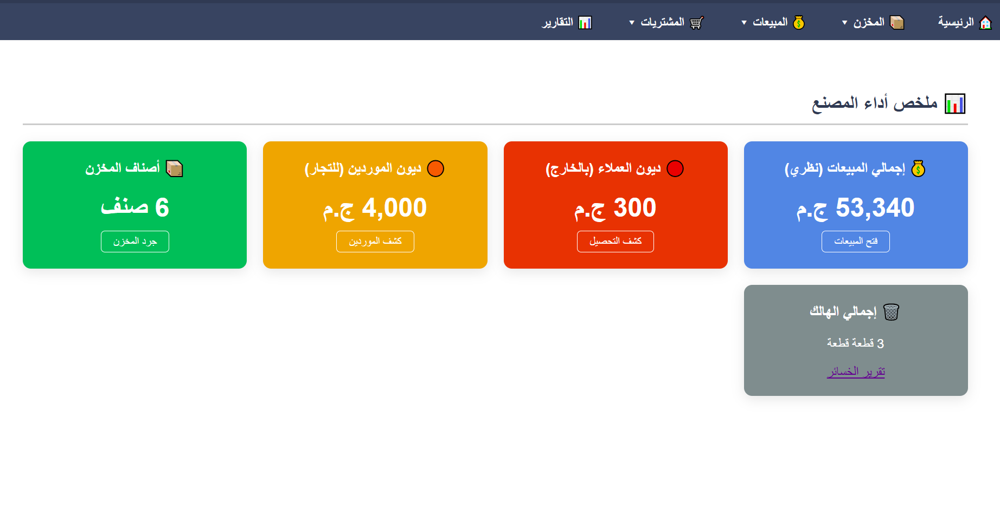
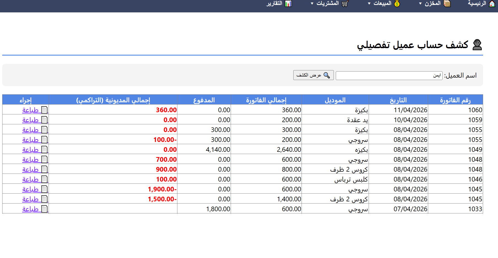

# 📦 نظام M.Store المتكامل لإدارة المصانع والمخازن

نظام محاسبي وإداري احترافي مصمم خصيصاً لتلبية احتياجات المصانع (مثل مصانع الجلود والشنط). يتميز النظام بواجهات عصرية وسهولة فائقة في متابعة الديون والتحصيلات وحركة المخزن اللحظية.

---

## 🚀 نظرة عامة على النظام
يوفر النظام لوحة تحكم شاملة تعطي صاحب العمل رؤية كاملة عن أداء المصنع في ثوانٍ معدودة، مما يسهل عملية اتخاذ القرار وتجنب الخسائر.

### 1️⃣ ملخص أداء المصنع (Dashboard)
واجهة ذكية تعرض إجمالي المبيعات، ديون العملاء، مديونيات الموردين، وإجمالي الهالك.

### 2️⃣ متابعة مديونيات وحسابات العملاء
نظام دقيق لعرض الفواتير المستحقة، المبالغ المدفوعة سابقاً، والمتبقي الصافي لكل عميل مع إمكانية التحصيل الفوري.

### 3️⃣ تنبيهات المخزن والنواقص
نظام ذكي ينبهك تلقائياً بالأصناف التي أوشكت على النفاد لضمان استمرارية الإنتاج.

---

## ✨ المميزات الرئيسية:
* **إدارة المبيعات:** إصدار فواتير جديدة، مرتجع مبيعات، وكشف حساب تفصيلي.
* **التحكم في المخزن:** جرد الأصناف ومتابعة الهالك بدقة.
* **التقارير المالية:** تقارير لحظية عن ديون الموردين (التجار) والتحصيلات الخارجية.
* **واجهة مستخدم Responsive:** تصميم مريح وسهل الاستخدام يعتمد على تقنيات الويب الحديثة.

---

## 🛠 التقنيات المستخدمة:
تم بناء هذا النظام باستخدام تقنيات مايكروسوفت لضمان الاستقرار والأمان:
* **ASP.NET (C#)** لتطوير المنطق البرمجي والواجهات.
* **SQL Server** لإدارة قواعد البيانات الضخمة والمعاملات المالية.
* **CSS & Bootstrap** لتصميم واجهة مستخدم عصرية وجذابة.

---

## 📞 للتواصل والطلب
إذا كنت ترغب في الحصول على نسخة تجريبية من النظام أو تخصيصه لعملك الخاص، يمكنك التواصل معي:
* **المطور:** محمد
* **المشروع:** نظام لإدارة المصانع.
